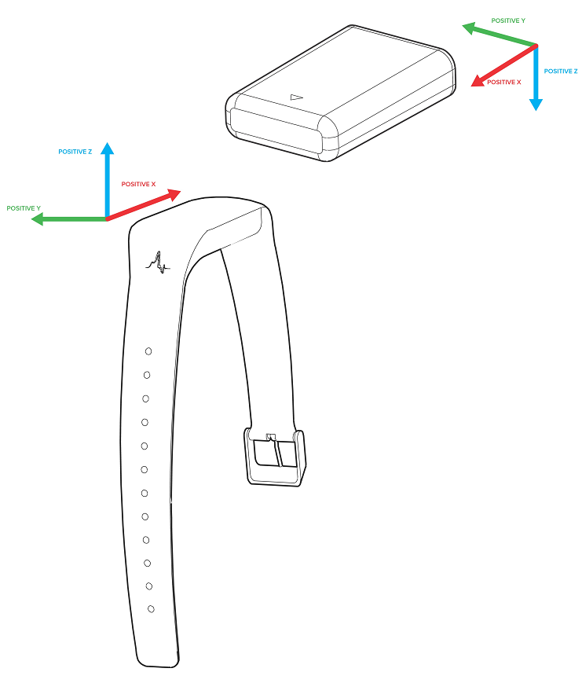

# AX Orientation

## AX Accelerometer Axes (AX3 and AX6) and Gyroscope Rotation (AX6-only)

> When observed on the etched largest face (the LED away, with the longer end of the USB connector closer to you): positive-X matches the "alignment arrow" towards the slightly tapered end of the puck; positive-Y is in the plane of the etched face 90 degrees clockwise; positive-Z is away through the face.  The gyroscope positive rotations are clockwise, when observed from the origin, along each axis.  


Note: `⊗`, rendered `(+)` below, is used to denote the axis going away from the viewer into the plane; while `⊙`, rendered `(.)` below, is used to denote the axis coming towards the viewer from the plane.  In the diagrams below, `*` denotes the thinner, slightly tapered end of the puck.

```
+---+-----------------------+
|   |                  y    |
|   |                  ^    |
|   |   ^              |    |
| * |  |-| \/         .-->  |
|   |  | | /\     ^  ' |    |
|   |        x <--|---(+)z| |
|   |             \_   <-'  |
+---+-----------------------+
```

Device orientation diagram:




## AX Device Rotation: Axis Inversions

The effect of recording with a device oriented differently will be to invert two of the axes -- which two depends on the way it was flipped, as described below.
 
However, you may not need to be too concerned as many analysis algorithms do not use the sign of the data (including all of the analysis options built-in to *OmGui*).  Many analysis algorithms for accelerometer data just take the *vector length* and are insensitive to orientation.  Also of note, the sleep algorithm "Estimating sleep parameters using an accelerometer without sleep diary" (e.g. in GGIR), the X/Y values are squared (removing the sign) and, although the Z-axis sign will change the sign of the arctangent (and the angle), it is only the absolute difference in (filtered) angles that is actually used, which is insensitive to the inversion. 

To "future proof" your dataset against future algorithms that might be sensitive to the sign of the data, it is recommended that known inversions are documented.


### Axis at no rotation

```
+---+-----------------------+
|   |                  y    |
|   |   ^              ^    |
| * |  |-| \/          |    |
|   |  | | /\    x <--(+) z |
|   |                       |
+---+-----------------------+
```

Transform: (identity).


### Rotated 180 degrees around Y-axis: "flipped on short side"

```
+-----------------------+---+
|    y                  |   |
|    ^              '   |   |
|    |          '' :':  | * |
| z (.)--> x    .. : :  |   |
|                       |   |
+-----------------------+---+
```

Transform: *x'* = -*x*, *z'* = -*z*.
Gyro: *gx'* = -*gx*, *gz'* = -*gz*.


### Rotated 180 degrees around X-axis: "flipped on long side"

```
+---+-----------------------+
|   |                       |
|   |  : : ''    x <--(.) z |
| * |  :': ..          |    |
|   |   .              v    |
|   |                  y    |
+---+-----------------------+
```

Transform: *y'* = -*y*, *z'* = -*z*.
Gyro: *gy'* = -*gy*, *gz'* = -*gz*.


### Rotated 180 degrees around both X-axis and Y-axis: "rotated 180 degrees around Z-axis", "flipped on long and short sides"

```
+-----------------------+---+
|                       |   |
| z (+)--> x    \/ | |  |   |
|    |          /\ |-|  | * |
|    v              V   |   |
|    y                  |   |
+-----------------------+---+
```

Transform: *x'* = -*x*, *y'* = -*y*.
Gyro: *gx'* = -*gx*, *gy'* = -*gy*.


## Undoing the rotation on `.wav` files

If you would like to adjust the axes of an exported `.wav` file:

1. Use the *OmGui* tool to generate a resampled `.wav` file from your `.cwa` file by performing one of the analysis steps. 

2. Run *Audacity* (available from: [audacityteam.org](https://www.audacityteam.org/)).

3. Ensure you have selected the preferences:

   * *Edit* / *Preferences* / *Import/Export* / *When exporting tracks to an audio file* / *Use custom mix (for example to export a 5.1 multichannel file)*, *OK*. 

   * *Edit* / *Preferences* / *Quality* / *Sampling* / *Default Sample Format* / *16-bit*. 

4. Select: *File* / *Open* / select the `.wav` file / *Open*. 

5. Perform one or more of these actions:

   * *x' = -x:* Click on *Left*  under *sample 1* / *Effect* / *Invert*.
   * *y' = -y:* Click on *Right* under *sample 2* / *Effect* / *Invert*.
   * *z' = -z:* Click on *Mono*  under *sample 3* / *Effect* / *Invert*.

6. Select: *File* / *Export Audio* / enter the name of the `.wav` file for exporting to / *Save* / *OK* / *OK*. 

<!--
7. Use *OmGui* tool to perform one of the analysis steps again, the inverted-axis `.wav` file will be used.  
-->
