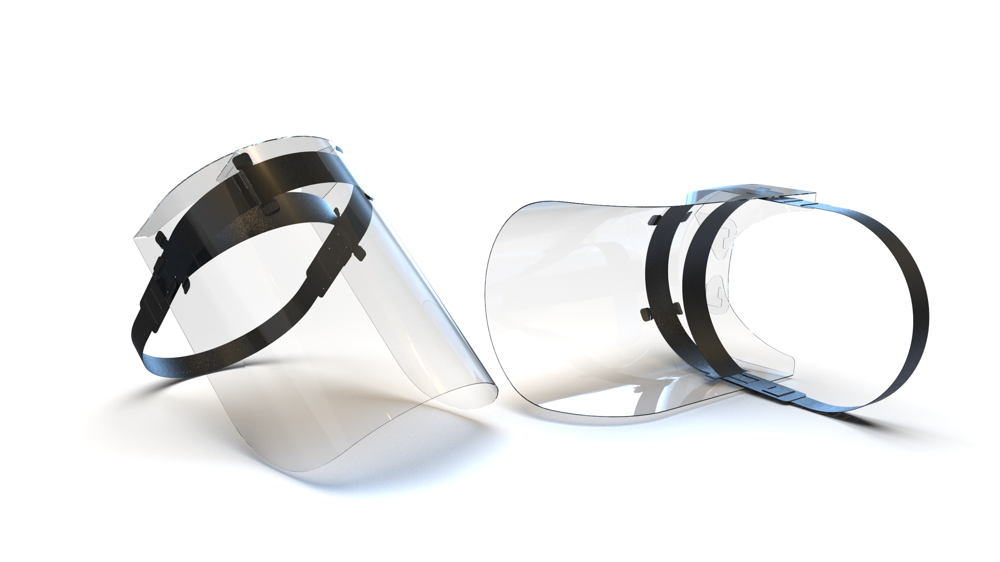

# Hannan Snap Visor

*Open source flatpack full face visor.*

**Last Updated: 14/04/2020**

**Share Link** : https://tinyurl.com/hannan-visor

As part of a national response to help the NHS during the Coronavirus pandemic. Open Lab, Newcastle University and Northumbria University partnered with AMAP, Sunderland University to design and develop a low cost, flatpack full face visor. The final output of this over the course of a 6 day design sprint was the Hannan Snap Visor.

## Summary

In honour of Katherine Hannan, a nurse went out of her way to be at the very front lines of caring for the sick during the Spanish Flu pandemic. The Hannan visor is a low cost full face visor designed for single sessional use.  Manufactured from Polypropylene and PVC, parts come  flat-packed, and can be sterilised then assembled in 1-2 minutes. The head strap is fully adjustable and allows the user the ability to wear full Personal Protective Equipment (PPE) during use.

The design originated from a laser cut version concept by [Smoke N Mirrors](https://community.andmirrors.co.uk/t/covid-19-laser-cut-face-shield/168) March 28, 2020.  After analysis and testing with healthcare workers the visor was completely redesigned to allow for the ability to manufacture via Die-cutting. This could allow the visor to be produced at scale and speed. 

The design has been through a series of iterations and testing with NHS healthcare workers at NHS trusts as well as with GP’s in the local area. Design modifications include new visor to cover face including the upper forehead preventing any aerosol or spatter to access from above. A redesigned adjustable "barbed" headband allowing the user to pull tightly with one hand, locking the visor in place. 

## Compliance 

The design of this product conforms with relevant essential health and safety regulations under the PPE Regulations  and with requirements of **BS EN 166:2002** (Personal Eye Protection).

For visors this would include requirements for:
* an adjustable head band arrangement.
* Safety visors need to be fog free.
* All products need to be latex free.
* Any product that contains phthalates must be indicated on the packaging in accordance with: Medical
Devices Regulation 2017/745. Personal Protective Equipment
* All products must have their CE marking clearly evident on the product and/or packaging and must
conform to the relevant directive: Medical Devices Regulation 2017/745

In light of the COVID-19 outbreak, the UK Government has taken steps to ease regulatory requirements for a limited time to speed up the supply of essential COVID-19 related Personal Protective Equipment (PPE) products into the UK market: 

Where the product will be manufactured for supply to NHS bodies for protection use by healthcare workers, it will not be necessary to carry out a conformity assessment or declaration and the product may be supplied without CE marking. 

This product may not be supplied to other parties or for any other uses without first contacting a Notified Body  and beginning conformity assessment procedures.

NO REPRESENTATION, PROMISE OR WARRANTIES, EITHER EXPRESS OR IMPLIED, IS GIVEN CONCERNING THE SUITABILITY OF THESE FACE SHIELDS FOR ANY MEDICAL OR PERSONAL PROTECTION USE INCLUDING, WITHOUT LIMITATION, THEIR EFFECTIVENESS TO FILTER, BLOCK OR PROTECT AGAINST ANY PATHOGEN OR PARTICLE INCLUDING SARS-COV-2 OR ANY OTHER RELATED TO COVID-19.

## Specification

| Parameter                     | Value                                  | Notes                                  |
|:------------------------------|:---------------------------------------|:---------------------------------------|
| Visor Size                    | 338mm x 285mm                          | (w) x (h)                              |
| Visor Weight                  | 55g                                    |                                        |
| Material                      | PVC / Polypropylene                    |                                        |
| Usage                         | Multiple or Single Session             | Must be resterilised                   |
| Assembly Time                 | Approx 1-2 mins                        |                                        |
| **Visor**                     |                                        |                                        |
| Material                      | 400 Micron PVC- Clear                  |                                        |
| Impact strength, min.         | 550 kJ/m/s                             | DIN EN ISO 8256 measured lengthwise    |
| **Head Band / strap**         |                                        |                                        |
|  Material                     | 450 Micron Polypropylene - Black       |                                        |
|  Head Sizing                  | Approx 53.5cm - 73.8cm (21" - 29")     | Barbed locking mechanism & hook        |
| **Addtional**                 |                                        |                                        |
| STERILISATION REQUIRED*       | Method: Isopropyl alcohol 70%          | * All visors are shipped unsterilised  |

## Manufacture

The following design has been intended for manufacture through die-cutting. The design can also however be made through laser-cutting. We have trialled several prototypes through this manner. 

**PLEASE NOTE** Do not laser process any PVC. This is dangerous and may damage your machinery through the release of Hydrogen Chloride. Please use alternative materials for the clear visor such as PET. 

The is made from one of two types of material:

* PVC - The clear visor area
* PP - The adjustable head strap and mount for the clear visor.

The visors can be shipped flatpacked and assembled via the end user using a series of "IKEA style" textless instructions for assembly as seen below. When distributing this design or visor, ensure that the end user has a copy of both the data sheet and the instructions.

## Usage

Recipients of the face shields are responsible for using their own judgement before deciding to order, receive, distribute and use these homemade face shields in any setting. Prior to use these visors should be sterilised. These face shields are single sessional use only. Discard after use. It is expected that these face shields will be used in conjunction with a face mask protecting the nose and mouth, in accordance with relevant guidelines. Face shields are not a replacement for or negate the need for users to continue to stringently follow the recommended hygiene practices or other relevant guidelines.

## Open Source Design

This design has been open sourced under the [Open Movement](https://openmovement.dev) platform at Newcastle University in collaboration with Northumbria University. The hardware (designs, layouts and schematics), and documentation are available under a [Creative Commons 3.0 BY Attribution License](../LICENSE.TXT).

## Documents

* Data Sheet:[Hannan Datasheet](Hannan%20Open%20source%20Visor%20v1.3.pdf)
* Instructions:[A4 Instruction Manual](Instructions.pdf)

## Technical Drawings
* Polypropelene Headstrap [Die cut DXF](HANNAN-SNAP-VISOR-STRAP-115.pdf)
* PVC / PET  Visor [DIE CUT DXF](HANNAN-SNAP-VISOR-SCREEN-115.pdf)

## Contact  

For more information of help with the Hannan Visor please contact:

Thomas Nappey - Thomas.Nappey@newcastle.ac.uk

Simon Scott-harden - simon.scott-harden@northumbria.ac.uk
