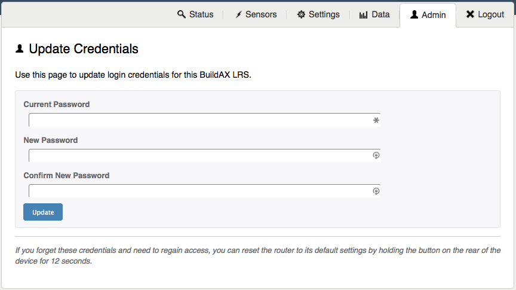

[//]: # (Web Admin Panel User Guide)

# BuildAX LRS Admin Panel

A web configuration interface is provided to make setting up a BuildAX 
installation easier. This document gives an overview of the admin panel 
functionality.

**Browser Support:**
All modern, standards-compliant web browsers are supported. Older browsers may
experience reduced functionality, for example Microsoft Internet Explorer
version 8 or lower. A warning message will be displayed in this case.

## Setting up

As described in the [Quick-Start guide](quickstart.md#lrs-setup), the data files
for the web-administration interface must be copied onto the SD card before
use. A 404 error will be reported if the files are not found in the correct
location on-disk, under the WWW folder. The data files for the most recent 
version can be downloaded [here](https://github.com/digitalinteraction/openmovement/tree/master/Downloads/BuildAX/LRS-Firmware).

**Upgrading the Web Interface:**
The web data files may be periodically updated as new features become
available. The new files will be uploaded to the Open Movement repository,
and can be upgraded on the LRS by deleting the previous version from the
SD card, and copying over the new files.

Note that you may also need to [upgrade the firmware](firmware.md) on the
LRS if you experience error messages after upgrading the web UI files.

## Login

The LRS configuration interface is protected with a username and password. 
These should be updated from the Admin panel when you first log into the site.

 

The default login credentials for the BuildAX LRS are:

*   Username: admin
*   Password: password

For information on how to change these credentials, see [here](#admin). Note
also that the login form on this page is not yet protected by SSL encryption
(the https:// scheme), so using a unique password is encouraged. A future 
firmware update will be deployed to enable this functionality for self-signed
SSL certificates.

## Status 

The Status tab is the landing page for the system, and allows users to verify
the running state of the device, including the log file (binary or plaintext)
and the status of LRS peripherals.

 

## Sensors

The sensor display page shows a live data stream from the sensors. This can be
useful while paring sensors, as they will appear immediately on the graph when
connected to the LRS.

 

The duration of the graph can be adjusted at the bottom of the page, showing a
range of data up to 60 minutes. The number of sensors displayed is not limited,
and a sensors can be excluded from the graph individually using the checkboxes.

Sensor data can also be viewed as a table. The static page shows the sensors
currently loaded into memory on the LRS, along with their details and the 
last values received. Only the last 20 sensors seen will be displayed.

 

### Name

The name of the BuildAX sensor device can be set when it is programmed using an 
FTDI cable, and will be sent as part of the encryption key transmission at 
pairing time. This is stored along with the key on the root of the SD card 
(external storage), and as such can be subsequently modified. The maximum 
length of a sensor node name is 32 characters.

### Last Seen

The last time a packet was received from a sensor, as defined by the internal
RTC on the BuildAX LRS.

### Address

The unique hardware identifier of the BuildAX sensor. This is generated at random 
by the sensor, but the pool of values (48-bit) is large enough to make 
collisions very unlikely.

### Last Packet

The last packet field is broken down into the individual values broadcast by 
the sensor. For a breakdown of the sensor values, see the [Field List](datafiles.md#field-list)
section.

### Limitations

Sensors appear in this table while their encryption keys are loaded into RAM on
the LRS. As the amount of RAM on the device is limited, only the most recent
20 sensors will be displayed in this table. This may become possible with future
hardware revisions.

## Settings

The BuildAX LRS has the ability to route streams of data to various different
data sources. The Settings page is used to turn on/off different streams, and
switch between streaming formats (binary or plaintext). The form is arranged by
stream type.

 

When a setting has been changed, it needs to be applied before it becomes
active. The Update button will appear when a setting needs to be applied.

 

If successfully applied, you will see the confirmation dialog appear below the
settings form:

 

## Fetch

Data can be retrieved from the LRS remotely via the fetch interface. The form
on the Data tab is used to format requests to the LRS.

 

Fetch types relate directly to the logging types- if your LRS is logging in
plaintext mode you should use the plaintext fetch- the same goes for if the
LRS is logging in binary.

The Fetch form exposes four different ways to request data:

- Date/Time
- File
- Sample Number (as a range)
- Last N Samples (from most recent backwards)

In addition, if the LRS determines that the parameters entered do not
translate to an acceptable range, an error 400 (Bad Request) will be returned.

## Admin

To update the login credentials for the LRS, simply fill in the form on the
Admin tab. There are no hard-coded complexity requirements for the password, but
normal convention should be followed. The maximum password length is 32
characters.

 

**Reset Password:**
If the password is forgotten, it must be reset by physically
accessing the LRS and loading the default settings. This reset procedure can
be performed by holding down the button on the rear of the LRS for 12
seconds.

